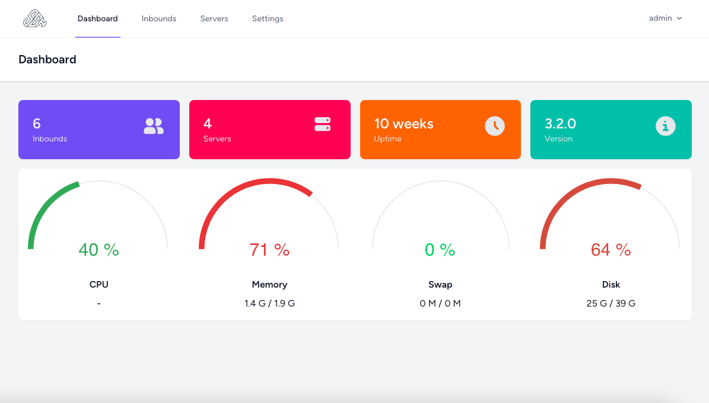

<p align="center"><a href=""></a></p>

<h2 align="center">
SSH Accounting Panel
<br/>
<br/>
<p>
<a href=""></a>
<a href=""></a>
</p>
</h2>


## About

This app provides you an easy way to create vpn accounts including ssh and outline protocols on your server.
You can either create accounts on your local machine or on the remote servers. The app also provides you
a cli command called `sap` to interact with it through the terminal.

<p align="center"><a href="#"></a></p>

## Features

- Add/Update/Delete inbounds
- Add multiple servers
- Activate/Deactivate inbounds
- Limit inbounds to specific bandwidth usage
- Limit concurrent connections of inbounds
- Set expire date for inbounds
- Set default settings for inbounds
- Set UDPGW port on your servers
- Set a domain and port
- Add SSL certificate to your domain
- Telegram bot support
- Dropbox daily backup support
- Outline VPN support

## Supported OS

- Ubuntu LTS (Tested on v20.04)

## Install / Uninstall

### Install
To install the panel, run the following command on your server:
```
wget -O sap.sh https://raw.githubusercontent.com/armineslami/SSH-Accounting-Panel/master/sap.sh && sudo bash sap.sh
```

### Uninstall
To uninstall the panel run the following command on your server and from the menu choose uninstall option:
```
sap
```

## License

The panel is open-sourced software licensed under the [MIT license](https://opensource.org/licenses/MIT).
